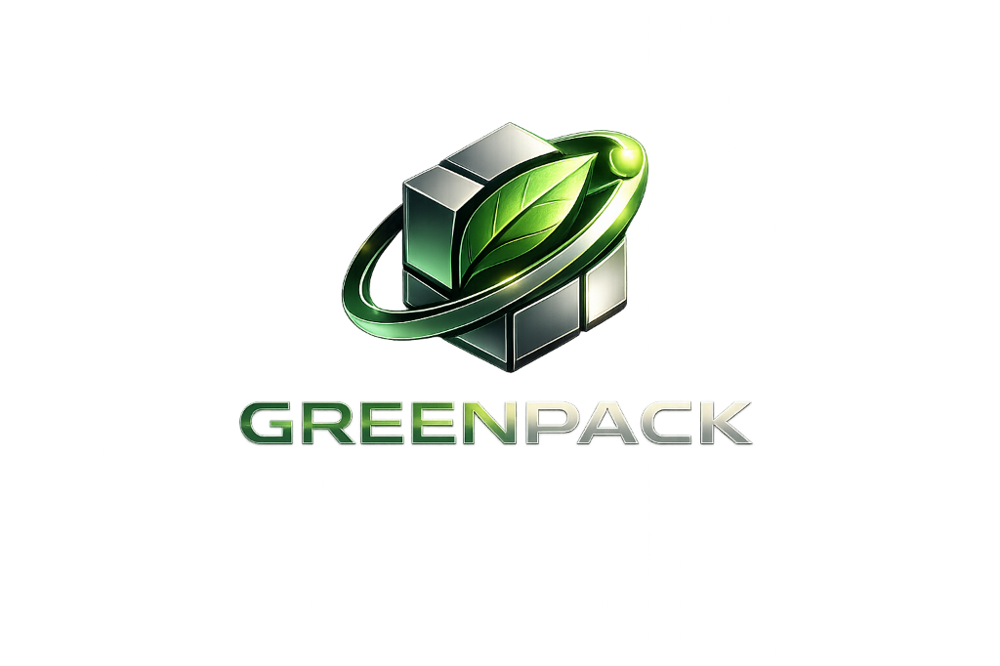

  
  
<b>Revolutionizing the Recycling Supply Chain with AI & Blockchain</b>

  

 

GREENPACK is a next-generation platform designed to connect waste collectors (Kabadiwalas) with recycling industries. By leveraging cutting-edge **Glassmorphism UI**, **AI predictions**, and **Blockchain-verified** trust scores, GREENPACK brings unprecedented transparency, efficiency, and scale to the scrap economy.

---

## 🚀 Live Demo & Login Flow

**Experience the platform live:** [greenpack.pages.dev](https://greenpack.pages.dev)

Follow these step-by-step instructions to experience the live platform:

1. **Navigate to the Login Page**: Click the **Sign In** button in the top-right corner of the landing page, or go directly to [greenpack.pages.dev/auth/login](https://greenpack.pages.dev/auth/login).
2. **Select Your Role**: Choose one of the three available portal roles:
   - **Kabadiwala** (Collection center / broker dashboard)
   - **Industry** (Recycling manufacturer dashboard)
   - **Admin** (Platform administrator dashboard)
3. **Auto-Fill Demo Credentials**: Click the **Auto-fill** button in the dashed box at the bottom of the card to automatically load the verified demo credentials.
4. **Sign In**: Press the **Sign In** button to instantly authenticate and access your selected role's dedicated, real-time dashboard.

---

## 🌟 Key Features

1. **Role-Based Portals:** Tailored dashboards for Kabadiwalas, Industries, and Admins.
2. **AI Supply Intelligence:** Predictive analytics for scrap supply forecasting.
3. **Blockchain Auditing:** Immutable trust scores and ESG compliance tracking.
4. **Dynamic Glass UI:** Premium, stunning aesthetics with micro-animations.

---

## 🛠️ Tech Stack

- **Frontend:** Next.js 16 (App Router), React, TypeScript
- **Styling:** Vanilla CSS (Glassmorphism), TailwindCSS (layout utility)
- **Animations:** Framer Motion
- **Hosting:** Cloudflare Pages (Static Export)

